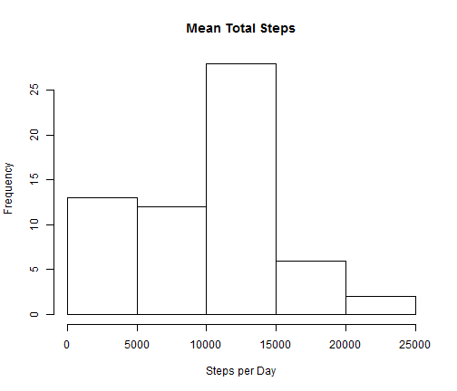
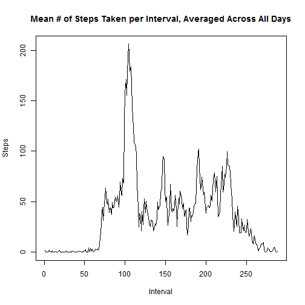
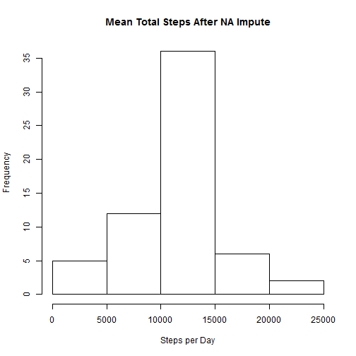
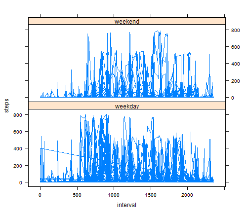

# Reproducible Research: Peer Assessment 1

This is a response to Reproducible Research, Peer Assignment 1.  You can find the assignment 
described in the readme file in the [github repository] (https://github.com/PaulKjer/RepData_PeerAssessment1) for this assignment.

###  Notes and Assumptions
- the function "complete" from the "mice" package is used in the imputation of data.  This process assumes the mice package has already been installed. 
- the file "activity.csv" is available in the current working directory.
- echo is required by the assignment and on by default.  The default is used and not explicitly turned on.

## Loading and preprocessing the data
The data is comma delimited data with column headers.  read.csv will load the data.

```r
activity = read.csv("activity.csv")
```


Convert the character representation of "date" into a object of class date and assign it to a new variable, posixDate

```r
activity$posixDate <- as.Date(activity$date, format = "%Y-%m-%d")
```


## What is mean total number of steps taken per day?
Use tapply to sum the steps per day, ignoring the NA values, then plot a histogram of the results

```r
hist(tapply(activity$steps, activity$posixDate, sum, na.rm = TRUE), main = "Mean Total Steps", 
    xlab = "Steps per Day")
```

 


The mean and median ...

```r
mean(tapply(activity$steps, activity$posixDate, sum, na.rm = TRUE))
```

```
## [1] 9354
```

```r
median(tapply(activity$steps, activity$posixDate, sum, na.rm = TRUE))
```

```
## [1] 10395
```


## What is the average daily activity pattern?

A time series plot of the 5-minute interval (x-axis) and the average number of steps taken, averaged across all days (y-axis)

```r
plot(tapply(activity$steps, activity$interval, mean, na.rm = TRUE), type = "l", 
    main = "Mean # of Steps Taken per Interval, Averaged Across All Days", xlab = "Interval", 
    ylab = "Steps")
```

 


Which 5-minute interval, on average across all the days in the dataset, contains the maximum number of steps?  The first value from the which.max function is the five minute interval, the second is the idex of the five minute interval. 


```r
which.max(tapply(activity$steps, activity$interval, mean, na.rm = TRUE))
```

```
## 835 
## 104
```


## Imputing missing values

Number of days with NA values

```r
sum(is.na(activity$steps))
```

```
## [1] 2304
```


Impute missing values and assign the result to a new dataset
My strategy to impute the missing value is to use the 'complete' function in the mice library. The mice complete function builds separate predictive models for each variable with missing values.  More information  about mice is available in the [package description.] (http://cran.r-project.org/web/packages/mice/mice.pdf).  The function takes a while, so the results are cached. 


```r
library(mice)
completedactivity = complete(mice(activity))
```

```
## 
##  iter imp variable
##   1   1  steps
##   1   2  steps
##   1   3  steps
##   1   4  steps
##   1   5  steps
##   2   1  steps
##   2   2  steps
##   2   3  steps
##   2   4  steps
##   2   5  steps
##   3   1  steps
##   3   2  steps
##   3   3  steps
##   3   4  steps
##   3   5  steps
##   4   1  steps
##   4   2  steps
##   4   3  steps
##   4   4  steps
##   4   5  steps
##   5   1  steps
##   5   2  steps
##   5   3  steps
##   5   4  steps
##   5   5  steps
```


Here's the histogram after imputing the missing values

```r
hist(tapply(completedactivity$steps, completedactivity$posixDate, sum, na.rm = TRUE), 
    main = "Mean Total Steps After NA Impute", xlab = "Steps per Day")
```

 


The mean and median after imputing the missing values ... 

```r
mean(tapply(completedactivity$steps, activity$posixDate, sum, na.rm = TRUE))
```

```
## [1] 10997
```

```r
median(tapply(completedactivity$steps, activity$posixDate, sum, na.rm = TRUE))
```

```
## [1] 11162
```


## Are there differences in activity patterns between weekdays and weekends?

The code below creates a new variable representing the name of the day of the week, the a value of either 'weekday' or 'weekend' is assigned depending on the original value of weekday, then steps per interval is plotted in a two row, one column lattice grid separated by the weekday/weekend value.

```r
completedactivity$weekday = weekdays(completedactivity$posixDate, abbr = TRUE)
completedactivity$weekday[completedactivity$weekday == "Mon"] <- "weekday"
completedactivity$weekday[completedactivity$weekday == "Tue"] <- "weekday"
completedactivity$weekday[completedactivity$weekday == "Wed"] <- "weekday"
completedactivity$weekday[completedactivity$weekday == "Thu"] <- "weekday"
completedactivity$weekday[completedactivity$weekday == "Fri"] <- "weekday"
completedactivity$weekday[completedactivity$weekday == "Sat"] <- "weekend"
completedactivity$weekday[completedactivity$weekday == "Sun"] <- "weekend"
library(lattice)
xyplot(steps ~ interval | weekday, data = completedactivity, layout = c(1, 2), 
    type = "l")
```

 


